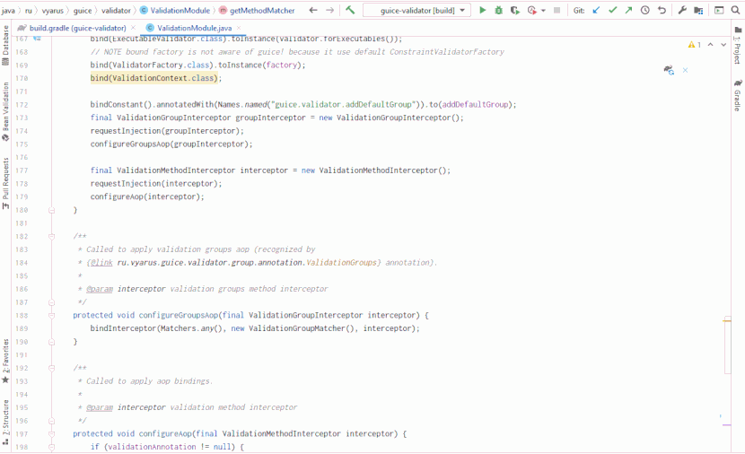

# Gradle quality plugin
[](http://www.opensource.org/licenses/MIT)
[](https://github.com/xvik/gradle-quality-plugin/actions/workflows/CI.yml)
[](https://ci.appveyor.com/project/xvik/gradle-quality-plugin)
[](https://codecov.io/gh/xvik/gradle-quality-plugin)

**DOCUMENTATION** http://xvik.github.io/gradle-quality-plugin

**Version 6.0 brings a few breaking changes**: [see migration guide](https://xvik.github.io/gradle-quality-plugin/latest/about/release-notes#migration-guide)

### About

Static code analysis for Java and Groovy projects using [Checkstyle](https://checkstyle.sourceforge.io/), 
[PMD](https://pmd.github.io/), [CPD](https://pmd.github.io/), [SpotBugs](https://spotbugs.github.io/) 
and [CodeNarc](https://codenarc.org/).
Plugin implements unified console output for all quality plugins, which greatly simplifies developer workflow: 
only console required for working with violations and makes it feel the same as java compiler errors.

For example, in IntelliJ Idea it would look like: 


Features:
* Zero configuration by default: provided opinionated configs applied to all quality plugins
    - Default configuration files may be customized
* Adds extra javac lint options to see more warnings
* Complete console output for all quality plugins
* Html and xml reports for all plugins (custom xsl used for findbugs html report because it can't generate both xml and html reports)
* Grouping tasks to run registered quality plugins for exact source set (e.g. checkQualityMain)

NOTE: the plugin is **compatible** with the gradle [configuration cache](https://docs.gradle.org/current/userguide/configuration_cache.html)


##### Summary

* Configuration: `quality`
* Tasks:
    - `initQualityConfig` - copy default configs for customization 
    - `checkQuality[Main]` - run quality tasks for main (or any other) source set
    - `qualityToolVersions` - print versions of used quality tools
    - `copyQualityConfigs` - internal task used to prepare default config files for quality tools (required for proper caching)
* Enable plugins: [Checkstyle](https://docs.gradle.org/current/userguide/checkstyle_plugin.html),
[PMD](https://docs.gradle.org/current/userguide/pmd_plugin.html),
[CodeNarc](https://docs.gradle.org/current/userguide/codenarc_plugin.html) 
* Configure external plugins (when applied):
[SpotBugs](http://spotbugs.readthedocs.io/en/latest/gradle.html), 
[CPD](https://github.com/aaschmid/gradle-cpd-plugin),
[AnimalSniffer](https://github.com/xvik/gradle-animalsniffer-plugin)

### Setup

NOTE: when updating plugin version in your project don't forget to call `clean` task to remove cached configs from previous plugin version

[](https://maven-badges.herokuapp.com/maven-central/ru.vyarus/gradle-quality-plugin)
[](https://plugins.gradle.org/plugin/ru.vyarus.quality)

```groovy
plugins {
    id 'ru.vyarus.quality' version '6.0.0'
}
```

OR

```groovy
buildscript {
    repositories {
        mavenCentral()
        gradlePluginPortal()
    }
    dependencies {
        classpath 'ru.vyarus:gradle-quality-plugin:6.0.0'
    }
}
apply plugin: 'ru.vyarus.quality'
```

IMPORTANT: if spotbugs is required, spotbugs plugin must be [applied manually](https://xvik.github.io/gradle-quality-plugin/latest/getting-started/#spotbugs): 

```
plugins {
    id 'com.github.spotbugs' version '6.2.5'
}
```

On multi-module projects it would be enough to declare spotbugs in the root project 
(quality plugin will detect its presence in build classpath and apply in modules):

```
plugins {
    id 'com.github.spotbugs' version '6.2.5' apply false
}
```

#### Compatibility

Plugin compiled for java 8, compatible with java 11 and above.

Supported gradle 7.1 - 9.


| Gradle | Version                                                      |
|--------|--------------------------------------------------------------|
| 7.1-9  | 6.0.0                                                        |
| 7.0    | [5.0.0](https://xvik.github.io/gradle-quality-plugin/5.0.0/) |
| 5.6-6  | [4.9.0](https://xvik.github.io/gradle-quality-plugin/4.9.0/) |
| 5.1    | [4.2.2](http://xvik.github.io/gradle-quality-plugin/4.2.2)   |
| 4.1    | [3.4.0](http://xvik.github.io/gradle-quality-plugin/3.4.0)   |
| older  | [2.4.0](http://xvik.github.io/gradle-quality-plugin/2.4.0)   |


Java requirements for quality tools:

| Tool       | Default version | Java version |
|------------|-----------------|--------------|
| Checkstyle | 11.0.0          | 17           |
| PMD        | 7.16.0          | 8            |
| SpotBugs   | 4.9.4           | 11           |
| CodeNarc   | 3.6.0           | 8            |

Incompatible tools will not be enabled: for example, on java 11 Checkstyle will not be enabled.

See details about [configuration for exact java versions](https://xvik.github.io/gradle-quality-plugin/latest/guide/java/)

#### Snapshots

<details>
      <summary>Snapshots may be used through JitPack</summary>

* Go to [JitPack project page](https://jitpack.io/#ru.vyarus/gradle-quality-plugin)
* Select `Commits` section and click `Get it` on commit you want to use (you may need to wait while version builds if no one requested it before)
    or use `master-SNAPSHOT` to use the most recent snapshot

* Add to `settings.gradle` (top most!) (exact commit hash might be used as version):

  ```groovy
  pluginManagement {
      resolutionStrategy {
          eachPlugin {
              if (requested.id.id == 'ru.vyarus.quality') {
                  useModule('ru.vyarus:gradle-quality-plugin:master-SNAPSHOT')
              }
          }
      }
      repositories {                        
          gradlePluginPortal()
          maven { url 'https://jitpack.io' }                    
      }
  }    
  ``` 
* Use plugin without declaring version: 

  ```groovy
  plugins {
      id 'ru.vyarus.quality'
  }
  ```  

</details>  

### Usage

Read [documentation](http://xvik.github.io/gradle-quality-plugin)

### Might also like

* [mkdocs-plugin](https://github.com/xvik/gradle-mkdocs-plugin) - beautiful project documentation generation
* [python-plugin](https://github.com/xvik/gradle-use-python-plugin) - use python modules in build
* [pom-plugin](https://github.com/xvik/gradle-pom-plugin) - improves pom generation
* [java-lib-plugin](https://github.com/xvik/gradle-java-lib-plugin) - avoid boilerplate for java or groovy library project
* [github-info-plugin](https://github.com/xvik/gradle-github-info-plugin) - pre-configure common plugins with github related info
* [animalsniffer-plugin](https://github.com/xvik/gradle-animalsniffer-plugin) - java compatibility checks
* [java-library generator](https://github.com/xvik/generator-lib-java) - java library project generator

---
[](https://github.com/xvik/generator-gradle-plugin)
